# Configurando o ambiente

## Introdução
Este documento visa explicar como realizar as configurações necessárias no Postgre, Maven e jBoss para utilização do framework Proddígio.

## Configurando o Postgre
### Inicializando o Banco

Na pasta de instalação do Proddígio acesse o diretório databases\postgre_portable e execute o PortablePostgreSQL.
Acesse o Postgre nos ícones ocultos, clique com o botão direito do mouse e selecione Progs>>Start PostgreSQL.

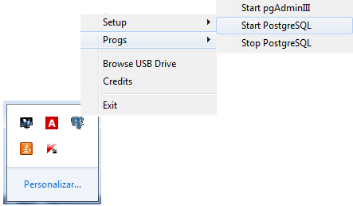

A seguinte janela deverá ser aberta com a mensagem SERVER STARTING e não poderá ser fechada durante toda utilização do banco.

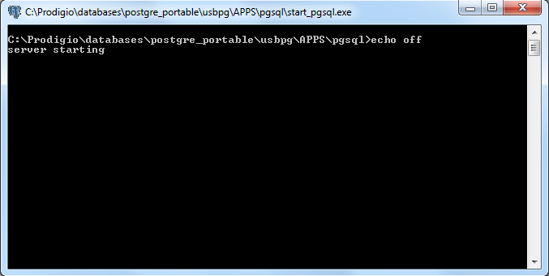

### Configurando e conectando ao servidor
Acesse o Postgre nos ícones ocultos, clique com o botão direito do mouse e selecione Progs>>Start pgAdminIII

No pgAdminIII clique em Adicionar conexão a um servidor

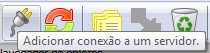

Configure o novo registro da seguinte maneira e clique em OK:

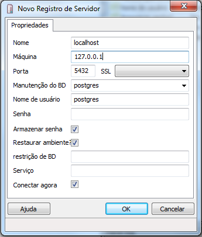

Conecte-se ao servidor

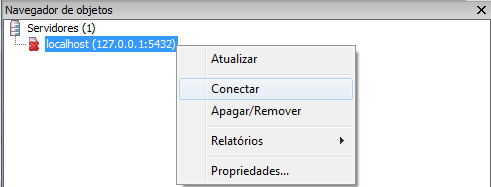

### Criando banco de dados
Clique com o botão direito em Banco de Dados e escolha a opção Novo Banco de Dados...

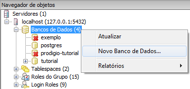

Defina o nome do banco e selecione Proddígio como Dono

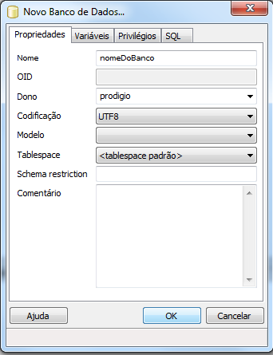

Clique em OK para finalizar e em seguida clique uma vez no banco criado.

### Encerrando conexão

Importante: não encerre a conexão com servidor durante a utilização de sua aplicação.

Acesse o Postgre nos ícones ocultos, clique com o botão direito do mouse e selecione Progs>>Start pgAdminIII

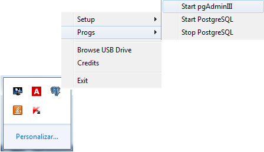

Clique com o botão direito do mouse em sua conexão e selecione a opção Desconectar.

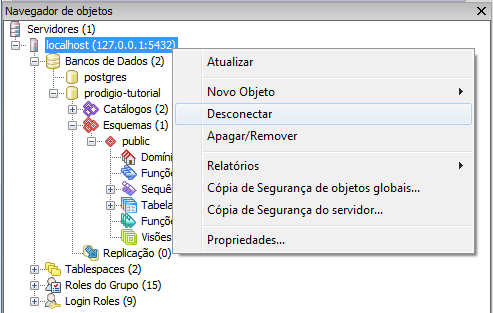

Acesse o Postgre nos ícones ocultos, clique com o botão direito do mouse e selecione Progs>>Stop PostgreSQL.

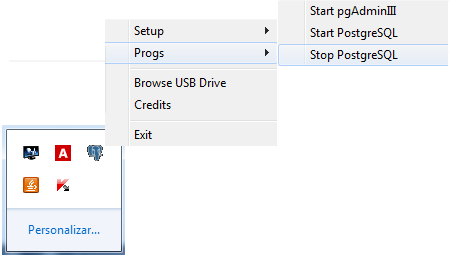

## Maven

Abra o Eclipse Luna, no menu superior selecione WINDOW >> PREFERENCES

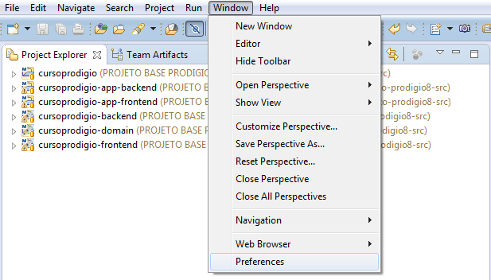

No campo superior esquerdo procure por ‘maven’

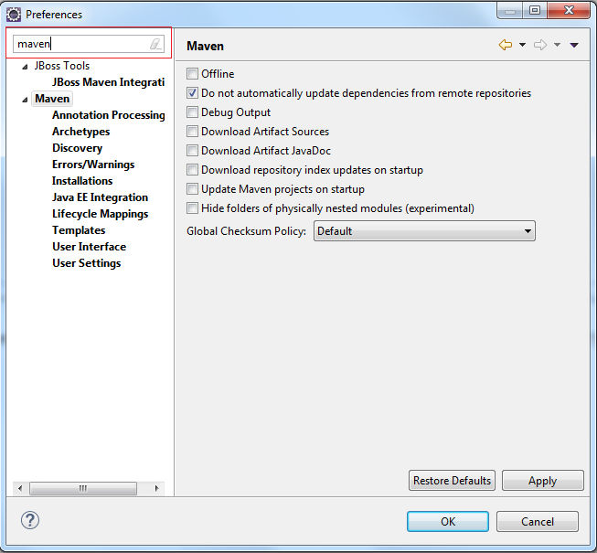

Acesse a propriedade ‘User Settings’:

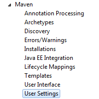

No campo ‘User settings’ selecione o arquivo settings.xml que se encontra na pasta maven\apache-maven-3.0.5\conf localizada na pasta de instalação do Proddígio e clique em APPLY. 

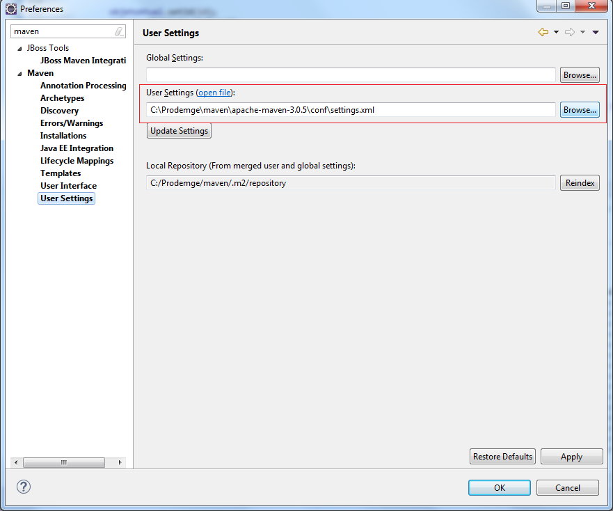

Agora vá para a opção MAVEN >> INSTALLATIONS 

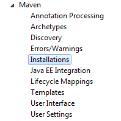

Clique no botão ‘Add...’ adicione e o diretório de instalação maven do Proddígio 

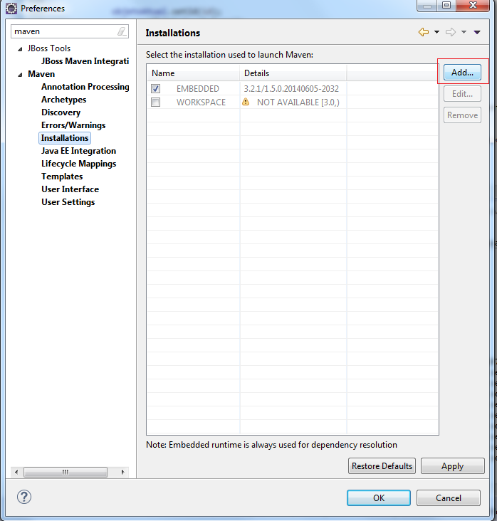
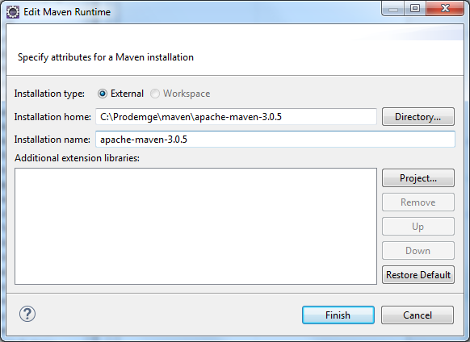

Clique em FINISH.
Certifique-se de habilitar o maven Proddígio, clique em APPLY e em seguida em OK.

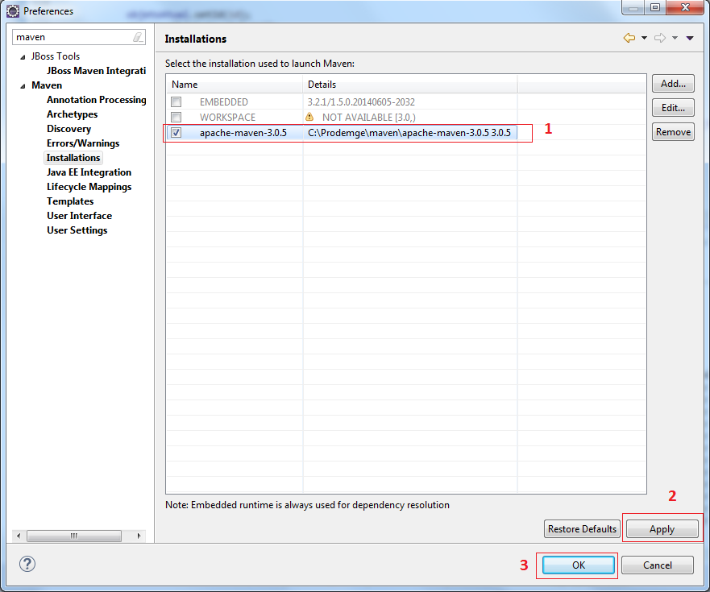