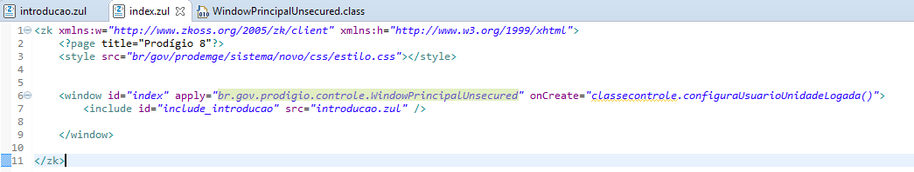

# Configurações para Projeto prod sem SSC

Requisitos: possuir ambiente configurado e projeto criado via archetype com SSC desabilitado na properties ‘includeSSC’ durante a criação do projeto.

## Introdução

Este documento visa explicar as configurações necessárias em um projeto prod sem SSC.

## Alterando a index.zul

Abra o arquivo index.zul que se encontra no projeto frontend dentro da pasta visão.

O arquivo deve estar parecido com o a seguir:

Altere o caminho da classe controle, no atributo apply da tag window para a classe br.gov.prod.controle.WindowPrincipalUnsecured da seguinte maneira:

 
Agora substitua a tag 

pela tag <include id="include_introducao" src="introducao.zul" />

Antes:

Depois:

Adicione o atributo onCreate="classecontrole.configuraUsuarioUnidadeLogada()" na tag window.

## Alterando a introducao.zul

Abra o arquivo introducao.zul que se encontra no projeto frontend dentro da pasta visão.

O arquivo deve estar semelhante ao a seguir:

Na tag <nav label="Menu" visible="true" onCreate="classecontrole.insereMenuPopUp(self)" />   
remova o atributo onCreate="classecontrole.insereMenuPopUp(self)".

Adicione agora os itens do menu como a seguir:

Observe bem a estrutura do menu e da tag custom-attributes.
Por último, no atributo apply da tag Window substitua “br.gov.prod.controle.WindowIntroducao” por “br.gov.prod.controle.WindowPrincipalUnsecured”.
<window id="principal" apply="br.gov.prod.controle.WindowPrincipalUnsecured">	

