# Projeto Proddígio via Archetype

Esta seção visa explicar como configurar o archetype Proddígio e realizar a criação de um projeto seguindo o padrão arquitetural.

**Obs. 1 :** O Archetype se encontrava na versão 2.5, a possível evolução do Archetype não altera os procedimentos de criação de projetos descritos neste documento, sendo necessário apenas a substituição do arquivo ``archetype-catalog`` para a versão mais recente.


## Configurando Archetype

Abra o Eclipse Luna. No menu superior selecione ``WINDOW >> PREFERENCES`` e acesse a opção ``MAVEN >> ARCHETYPES``

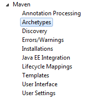

Clique em ``Add Local Catalog...`` e adicione o caminho para o catalogo do arquétipo mais recente e clique em OK:

Obs.: O arquivo ``archetype-catalog`` se encontra no diretório ``C:/Prodemge/ARCHETYPE``.

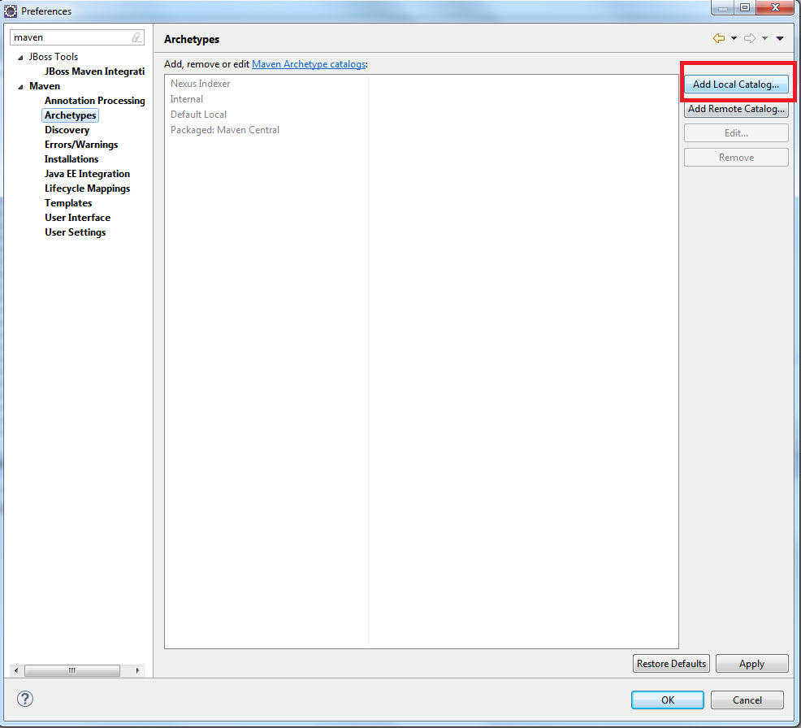
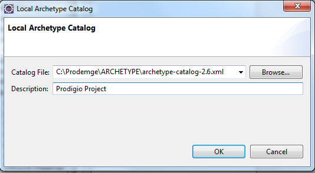

Aplique as modificações na janela Preferences clicando em ``Apply`` e em seguida clique em ``OK``.

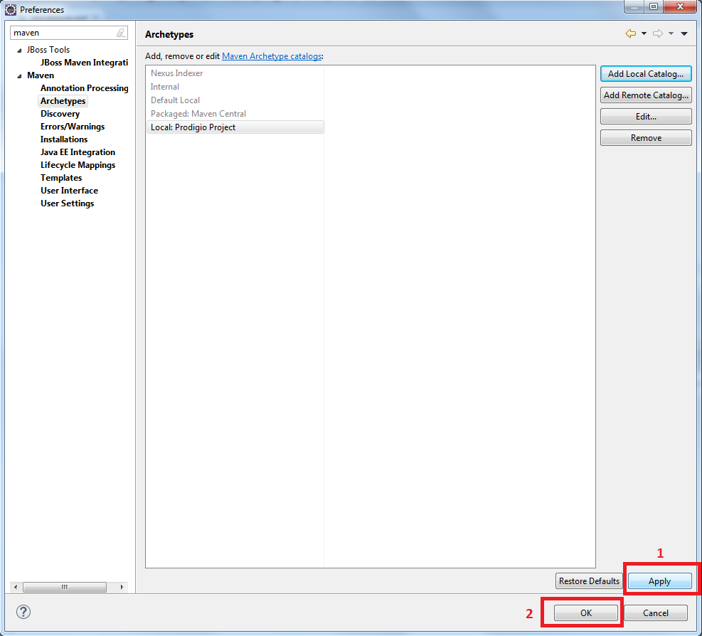

## Criando Projeto

No menu superior selecione ``FILE>> NEW>> Maven Project``.

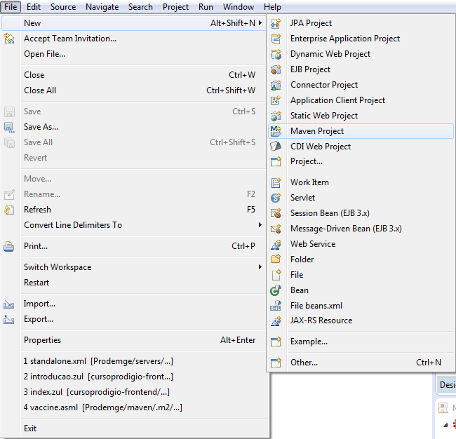

Utilizaremos o workspace padrão mas caso deseje alterar sua workspace selecione o diretório no Location clicando em ``Browse...``. 
Clique em ``Next``.

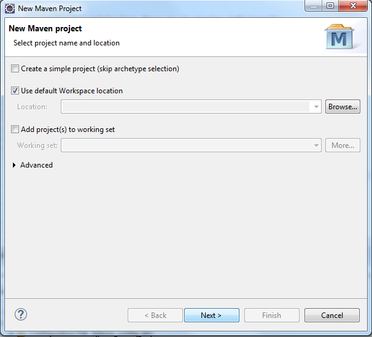

Agora selecione o catalogo do Proddígio e passe para o próximo passo.

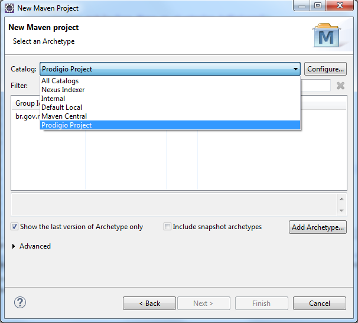
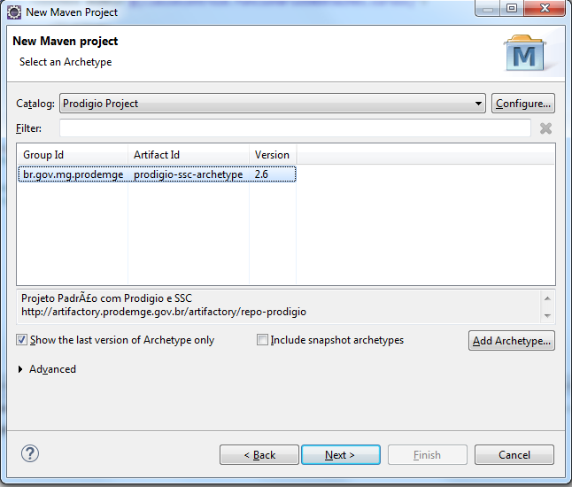

Especifique os parâmetros ``GroupId`` com o grupo do projeto, ``ArtifactId`` com o nome do projeto e Package com a estrutura de pacotes do projeto. 
Configure também as properties:

Obs.: o SSC vem habilitado por padrão, para desabilita-lo basta atribuir ‘n’ ao value da properties ``includeSSC``. Caso vá utiliza-lo atribua o valor padrão ‘y’.

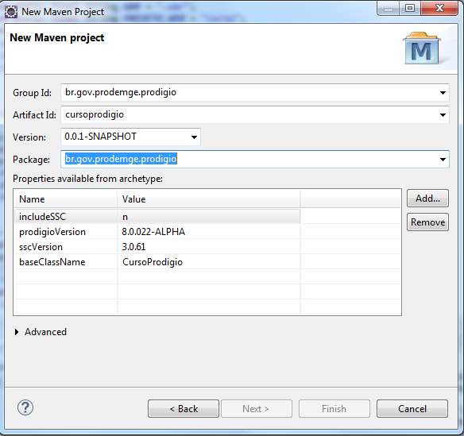

Na properties ``baseClassname`` coloque o nome do projeto com a primeira letra maiúscula.
Em ProddigioVersion  e  sscVersion coloque as versões mais recente do Proddígio e SSC respectivamente.

## Executando a aplicação

###  Adicionando  server

Na view ``SERVERS`` do Eclipse, clique na opção para adicionar um novo server. 

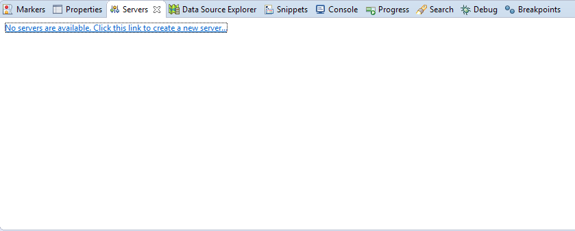

Escolha a versão mais recente do **jBoss Enterprise Application Platform** e clique em ``NEXT``

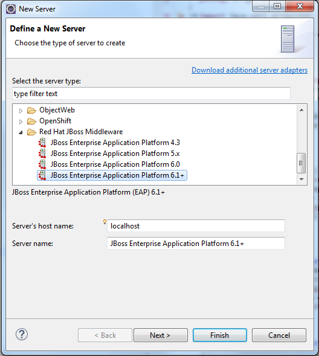

Selecione a opção ``Create new runtime`` e clique novamente em ``Next``

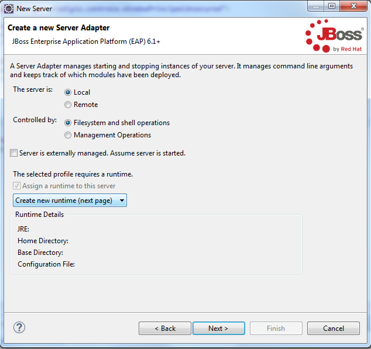

Renomeie a instância do servidor e no campo ``Home Directory`` coloque o caminho para o diretório onde se encontra o server jBoss.

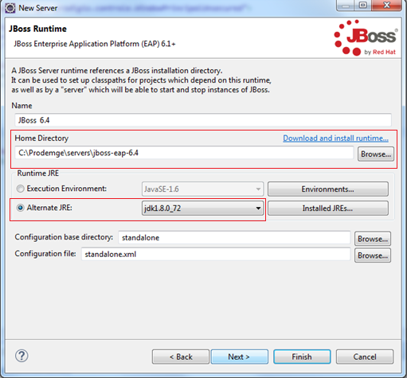

Certifique-se de marcar a opção Alternate JRE. Clique em ``Finish``.

### Configurando standalone

Abra o arquivo ``standalone.xml`` do jBoss

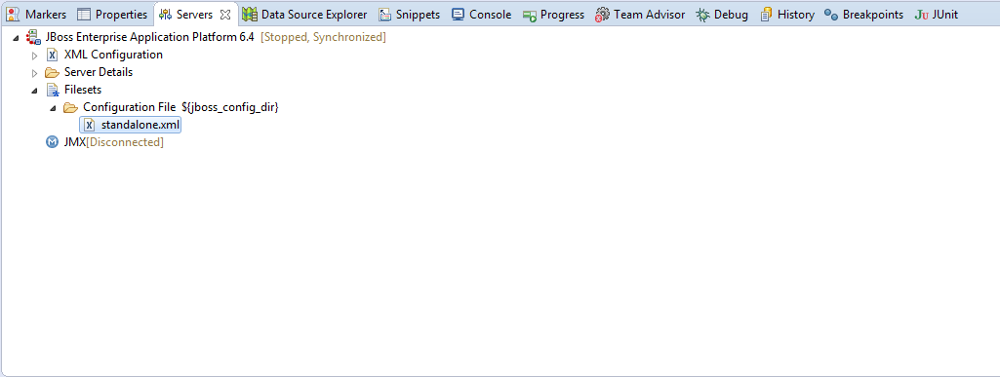

Configure o datasource de acordo com o seu banco de dados seguindo o modelo substituindo os campos ``nomeDaAplicacao`` e ``nomeDoBanco``.

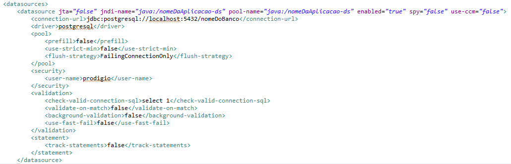
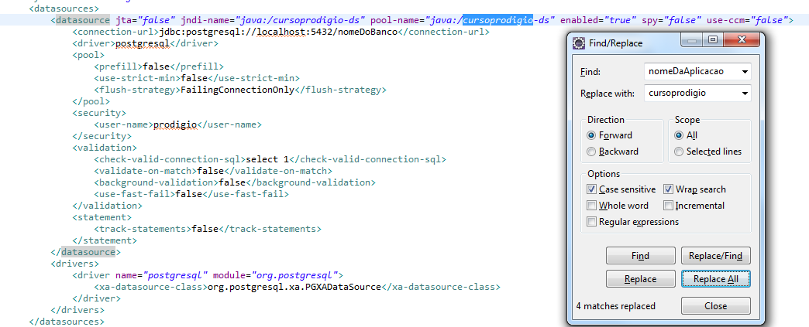

*Ferramenta Find/Replace(atalho ctrl+F)*

### Executando aplicação
Basta adicionar sua aplicação ao servidor e inicializa-lo.

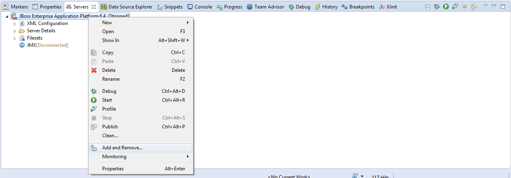
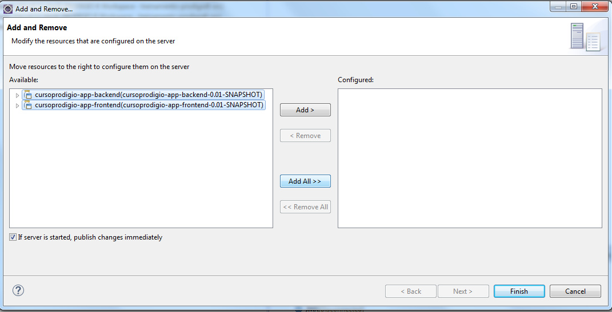
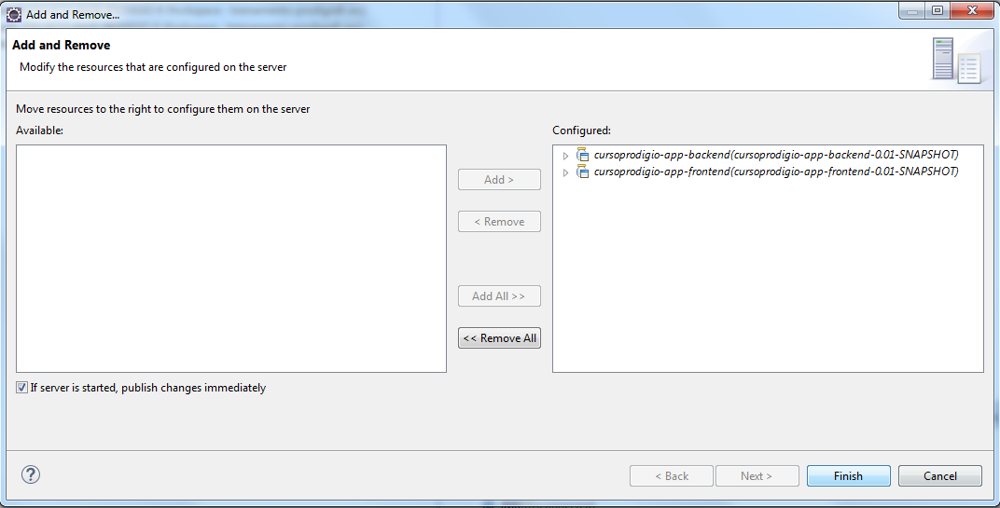
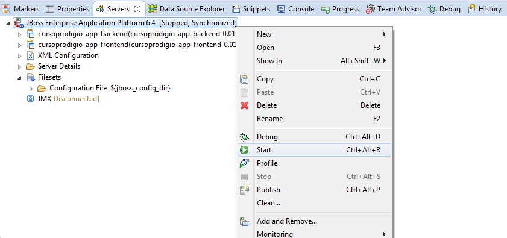

Sua aplicação poderá ser acessada pelo navegador através da URL: 

```sh
http://localhost:8080/nomeDaAplicacao-frontend/
```

