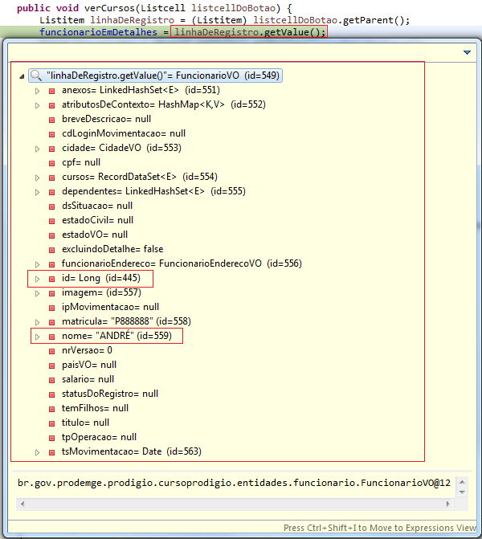

# Abrindo Popups na Listagem

Podemos inserir popups na listagem dos registros para exibir informações adicionais, como no exemplo abaixo:

Para isso devemos criar um objeto do mesmo tipo que a nossa entidade na classe de controle:

Na página Zul acessaremos os dados deste objeto, portanto o código do componente popup onde teremos um listbox ficará da seguinte maneira:
 
### Zul:	

	<popup id="cursoDetalhePopup">
		<panel title="Cursos">
			<panelchildren>
				<listbox model="@{classecontrole.funcionarioEmDetalhes.cursos}">
					<template name="model">
						<listitem>
							<listcell>
								<label value="${each.cursoVO.nome}"/>
							</listcell>
							<listcell>
								<label value="${each.cursoVO.tsMovimentacao}"/>
							</listcell>
						</listitem>
					</template>
				</listbox>
			</panelchildren>
		</panel>
	</popup>

Este objeto (funcionarioEmDetalhes) irá receber os atributos referentes a linha de registro que selecionarmos, por exemplo:

Ao clicarmos no botão “Cursos” da linha de registro do funcionário de nome “André”, o objeto funcionarioEmDetalhes receberá os atributos de “André” para que possam ser exibidas na popUp. Portanto no evento onClick do botão “Cursos” devemos chamar um método que configure o objeto funcionarioEmDetalhes e exiba a popup com os dados desejados. 

### Zul:

	<listcell>
		<button label="Cursos" onClick="classecontrole.verCursos()"/>
	</listcell>
 
### Método na Ctr:	

	public void verCursos() {
	
	}

Um dos modos de “descobrir” qual é o objeto selecionado é acessando a hierarquia dos componentes da tela até alcançarmos o componente Listitem que guarda em seu atributo Value o objeto da linha de registro.

 
Partindo do componente Button podemos acessar através do método getParent o componente Listcell, sendo assim para facilitar o acesso a hierarquia dos componentes passaremos como parâmetro para o método verCursos de nossa classe controle o Parent de Button (componente Listcell).

### Zul:

	<listcell>
		<button label="Cursos" onClick="classecontrole.verCursos(self.parent)"/>
	</listcell>

### Método na Ctr:	

	public void verCursos(Listcell listcell) {
	
	}

Agora precisamos voltar mais um passo na hierarquia dos componentes para chegarmos ao componente Listitem.
 
### Método na Ctr:	

	public void verCursos(Listcell listcell) {
		Listitem linhaDeRegistroSelecionada = (Listitem) listcell.getParent();
	}

O método getParent() do componente Listcell retornará o componente Listitem, que representa a linha de registro selecionada. 
Podemos então finalmente atribuir em nosso objeto funcionarioEmDetalhes o objeto da linha selecionada.

	public void verCursos(Listcell listcell) {
	Listitem linhaDeRegistroSelecionada = (Listitem) listcell.getParent();
			funcionarioEmDetalhes = linhaDeRegistroSelecionada.getValue();
	}

		
 

Feito isso basta acionarmos nossa popup.

	public void verCursos(Listcell listcellDoBotao) {
			Listitem linhaDeRegistro = (Listitem) listcellDoBotao.getParent();
			funcionarioEmDetalhes = linhaDeRegistro.getValue();
			Popup popupWindow = (Popup) getTela().getFellow("cursoDetalhePopup");
			popupWindow.open(listcellDoBotao);
			getBinder().loadAll();
	}

O método getFellow() retorna o componente da tela que possuí o id passado como parâmetro.

	getBinder().loadAll() -> atualiza todos os componentes da tela.

Resultado:

### Zul – selecaobox completo:

	<selecaobox>
		<sylistbox>
			<!-- CAMPOS DE PESQUISA (AUXHEAD) -- >				
	  		<listhead id="cabecalho">
	 			<listheadersort label="Nome" value="nome" />
	 			<listheadersort label="Data de criação" value="tsMovimentacao" />
				<listheadersort label="Matrícula" value="matricula" />
				<listheadersort label="Cidade" value="cidade.nome" />
	 	 	<listheader label="Foto" value="imagem" />
				<listheader label="Cursos" value="cursos.cursoVO.nome" />
	   	 	<listheader label=""></listheader>
	 		</listhead>
	
			<listitem height="25px">
	 			<listcellbind label="nome" />
	 			<listcellbind label="tsMovimentacao" />
	 	 		<listcellbind label="matricula" mask="A.AAAAA"/>
				<listcellbind label="cidade.nome" />
				<listcell>
					<imagebind content="@{objeto.imagem}" width="50px" height="50px"></imagebind>
	 	 		</listcell>
				<listcellbind label="nomesDosCursos" />
				<listcell>
	 	 	 		<button label="Cursos" onClick="classecontrole.verCursos(self.parent)"></button>
				</listcell>
			</listitem>
		</sylistbox>
		
		<popup id="cursoDetalhePopup">
			<panel title="Cursos">
				<panelchildren>
					<listbox model="@{classecontrole.funcionarioEmDetalhes.cursos}">
						<listitem>
							<listcell>
								<label value="${each.cursoVO.nome}"/>
							</listcell>
							<listcell>
								<label value="${each.cursoVO.tsMovimentacao}"/>
							</listcell>
						</listitem>
					</listbox>
				</panelchildren>
			</panel>
		</popup>
	</ selecaobox >

### Ctr:

	public class FuncionarioCtr extends CursoProdigioBaseCtr<FuncionarioVO> {
		FuncionarioVO funcionarioEmDetalhes;
		
		public FuncionarioVO getFuncionarioEmDetalhes() {
	 		return funcionarioEmDetalhes;
		}
	
		public void setFuncionarioEmDetalhes(FuncionarioVO funcionarioEmDetalhes) {
			this.funcionarioEmDetalhes = funcionarioEmDetalhes;
		}
		
		public void verCursos(Listcell listcellDoBotao) {
	 		Listitem linhaDeRegistro = (Listitem) listcellDoBotao.getParent();
	 		funcionarioEmDetalhes = linhaDeRegistro.getValue();
	 		Popup popupWindow = (Popup) getTela().getFellow("cursoDetalhePopup");
	 		popupWindow.open(listcellDoBotao);
	   		getBinder().loadAll();
		}
	}
	

