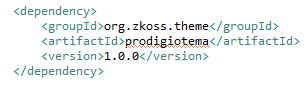

# Alterando tema pelo Eclipse:

Obs.: É necessário possuir o projeto do tema e um projeto prod abertos em sua workspace.

### Altere os arquivos .less da maneira que preferir.

 
### Após realizar as alterações clique com o botão direito do mouse sobre o projeto do tema e escolha a opção Run As>>Maven Install

 
### Feche o projeto do tema

 
# Alterando tema em outros editores 

### Feche o projeto do tema no Eclipse

 
### Acesse os arquivos do projeto (possivelmente: C:\prod\workspace\prodtema\prodtema\src\archive\web\zul\less)

 
### Edite os arquivos com o editor de sua escolha.

### Acesse o diretório do projeto pelo prompt e execute os seguintes comandos para compilar os arquivos less e gerar o jar de seu tema:

	set PATH=%PATH%;c:\prod\maven\apache-maven-3.0.5\bin

	mvn install -DgroupId=org.zkoss.theme -DartifactId=nomedotema -Dversion=1.0.0 -Dpackaging=jar

# Aplicando o Tema

### Adicione a dependência do tema no pom.xml do projeto web:
 

### Realize um Maven Update(Alt+F5) em todo seu projeto

### Executando aplicação
Basta adicionar sua aplicação ao servidor e inicializa-lo.

 
Sua aplicação poderá ser acessada pelo navegador através da URL: 

	http://localhost:8080/nomeDoProjeto-web/

### Limpe o cache do navegador para visualizar as alterações.
