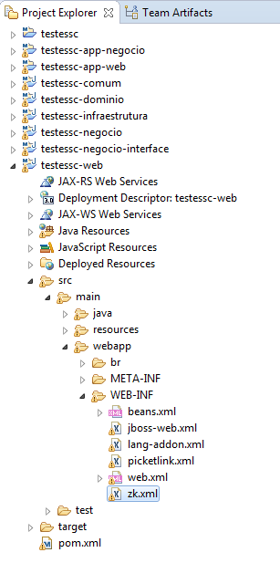

# Molds Bootstra

Abra o arquivo zk.xml 

e adicione as seguintes library-property:

	<library-property>
		<name>org.zkoss.zul.Button.mold</name>
		<value>bs</value>
	</library-property>
	<library-property>
		<name>org.zkoss.zul.Menupopup.mold</name>
		<value>bs</value>
	</library-property>
	<library-property>
		<name>org.zkoss.zkmax.zul.Navbar.mold</name>
		<value>bs</value>
	</library-property>
	<library-property>
		<name>org.zkoss.zul.Paging.mold</name>
		<value>bs</value>
	</library-property>
	<library-property>
		<name>org.zkoss.zul.Panel.mold</name>
		<value>bs</value>
	</library-property>

