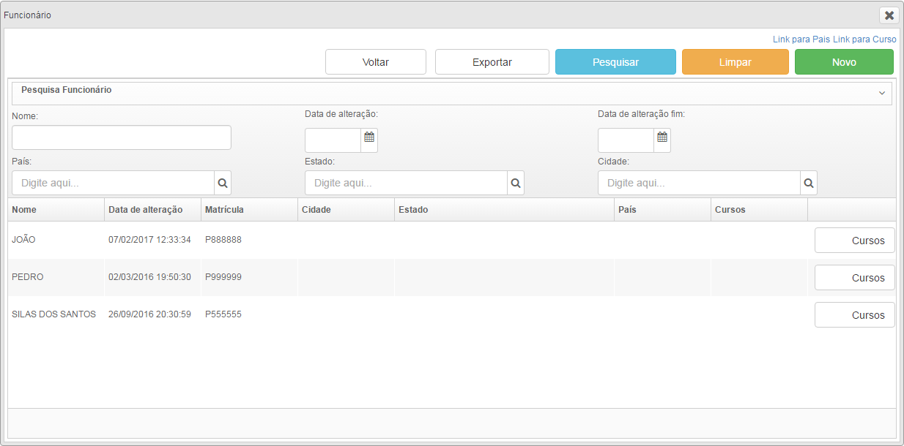
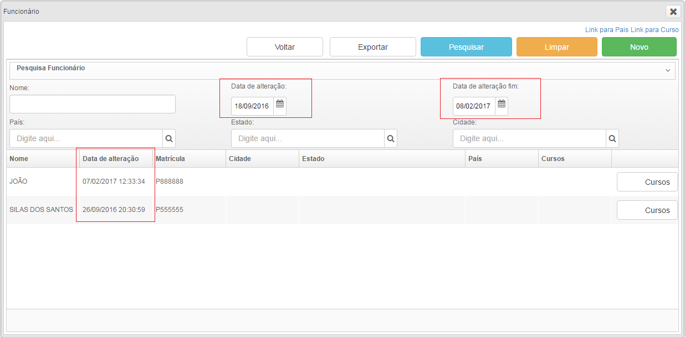

# Pesquisando dados em intervalos de datas

Podemos também realizar pesquisas de dados em determinado intervalo de datas. No exemplo a seguir realizaremos a pesquisa por registros que foram modificados em determinado intervalo de tempo, portanto utilizaremos o atributo ``tsMovimentacao`` mas poderíamos utilizar qualquer outro atributo ``Date`` da classe de dominio.
Para isso serão necessários dois campos do tipo ``dateboxbind`` dentro do cabeçalho de pesquisa.

	<auxhead class="cabecalhoPesquisa" >
		<auxheader>
			<dateboxbind nomeDoObjeto="classecontrole.objetoAtualArg.tsMovimentacao"/>
			<dateboxbind nomeDoObjeto="classecontrole.objetoAtualArg2.tsMovimentacao"/>
		</auxheader>
	</auxhead>

O ``objetoAtualArg`` trata-se de um objeto do mesmo tipo que o ``objetoAtual``, porém seus atributos são utilizados unicamente como argumentos para consultas no banco de dados. 
Já o ``objetoAtualArg2`` quando utilizado estabelece um limite para as consultas, isso significa que o resultado de nossas buscas serão o intervalo entre o ``objetoAtualArg`` e o ``objetoAtualArg2``.

*Figura 1- Pesquisa sem argumentos*
 

*Figura 2 - Pesquisa em determinado intervalo de datas*

