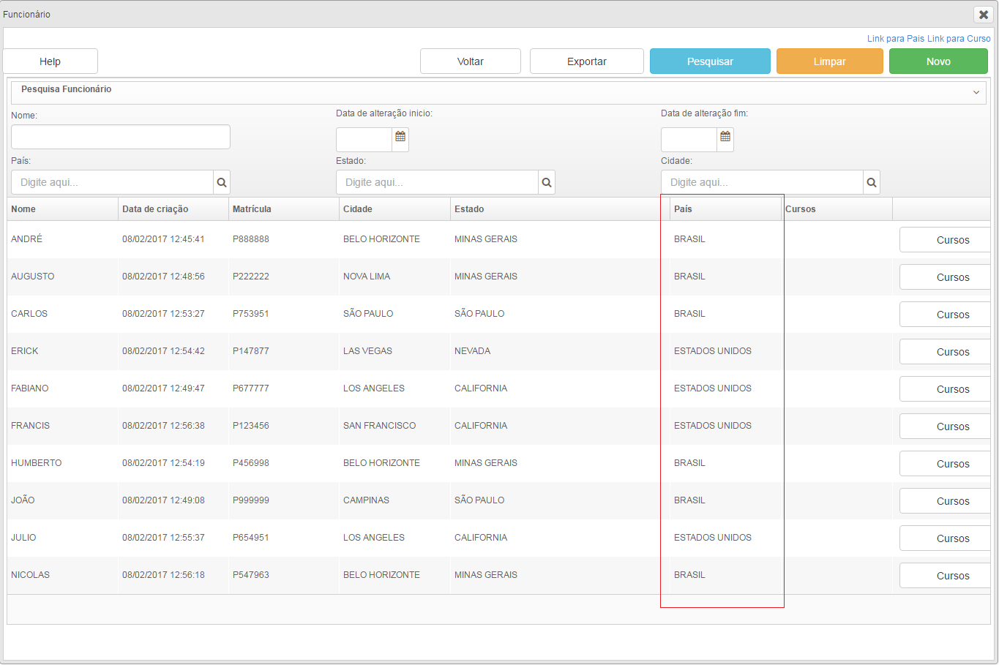
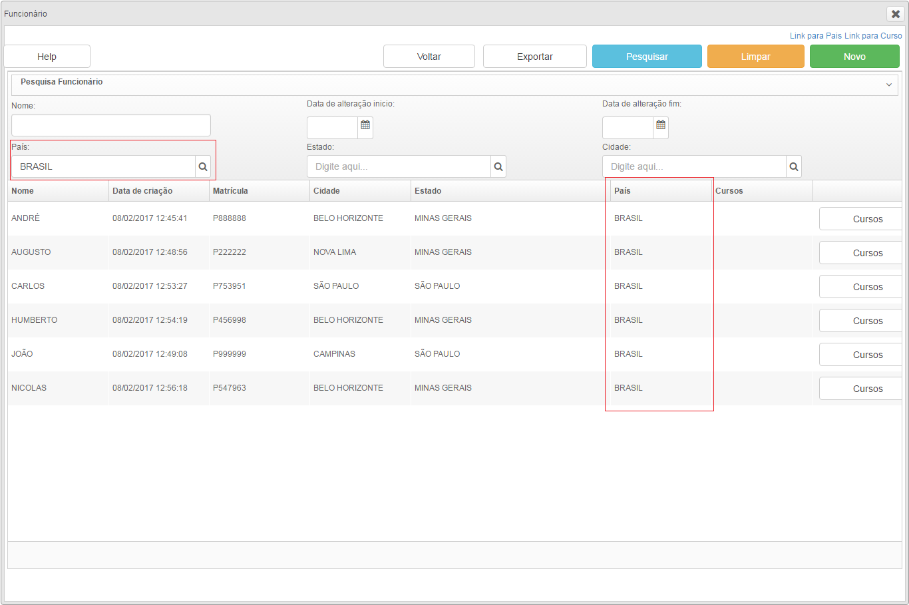

# Pesquisas utilizando objetos

Para empregarmos objetos como argumento de pesquisa utilizamos o componente bandboxbind e no atributo nomeDoObjeto utilizaremos classecontrole.objetoAtualArg.atributoUtilizadoComoArgumento
O objetoAtualArg trata-se de um objeto do mesmo tipo queo objetoAtual, porém seus atributos são utilizados unicamente como argumentos para consultas no banco de dados.	

No exemplo a seguir realizaremos a pesquisa de acordo com o país cadastrado nos registros dos funcionários, portanto utilizaremos o atributo paisVO mas poderíamos utilizar qualquer outro atributo Object da classe de dominio. Adicionaremos então nosso bandboxbind no cabeçalho de pesquisa:

	<auxhead class="cabecalhoPesquisa" >
		<auxheader>
			<bandboxbind nomeDoObjeto="classecontrole.objetoAtualArg.paisVO"/>	
		</auxhead>
	</auxheader>
					

*Figura 1 - Pesquisa sem argumentos*

*Figura 2 - Pesquisa utilizando o atributo 'paisVO' como argumento*