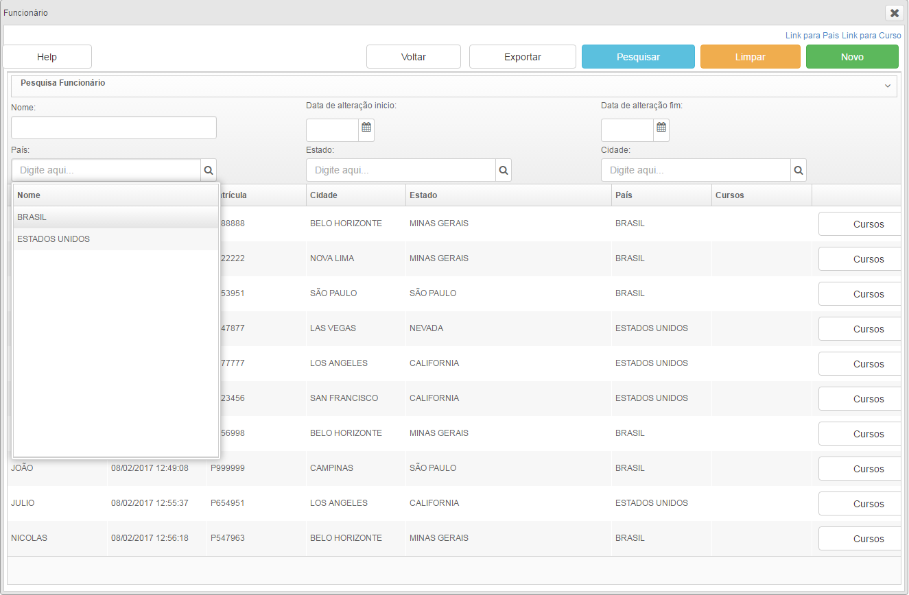

# Pesquisas utilizando objetos aninhados

Para empregarmos objetos como argumento de pesquisa utilizamos o componente bandboxbind e no atributo nomeDoObjeto utilizaremos classecontrole.objetoAtualArg.atributoUtilizadoComoArgumento
O objetoAtualArg trata-se de um objeto do mesmo tipo que o objetoAtual, porém seus atributos são utilizados unicamente como argumentos para consultas no banco de dados.

No exemplo a seguir realizaremos a pesquisa utilizando como argumento a cidade onde reside os funcionários, para isso precisamos selecionar o país e o estado ao qual a cidade pertence.

Para relizarmos um vínculo entre os campos com objetos que serão usados como argumento devemos adicionar alguns atributos na tag bandboxbind:
identificador: identificador único do componente bandboxbind que estabelecerá relação com outro componente bandboxbind. Atenção: id e identificador são atributos diferentes. 
dependenteDoComponente: identificador do componente ao qual o valor deste componente possuí relação de dependência.

Adicionaremos então nosso bandboxbind no cabeçalho de pesquisa, observe como ficará a relação entre os componentes:

	<auxhead class="cabecalhoPesquisa" >
		<auxheader>
			<bandboxbind nomeDoObjeto="classecontrole.objetoAtualArg.paisVO" identificador="pais”/>
			<bandboxbind nomeDoObjeto="classecontrole.objetoAtualArg.estadoVO" dependeDoComponente="pais" identificador="estados"/>
			<bandboxbind nomeDoObjeto="classecontrole.objetoAtualArg.cidade" dependeDoComponente="estados" identificador="cidades"/>
		</auxhead>
	</auxheader>

*Figura 1 - Pesquisa sem argumentos*
 

*Figura 2 - Selecionando País*

*Figura 3 - Estados disponíveis de acordo com o País selecionado*

*Figura 4 - Cidades disponíveis de acordo com o Estado selecionado*

*Figura 5 - Pesquisa utilizando Cidade como argumento*

