# SERVIÇOS SOAP

### Projeto backend

Crie a classe BaseWSFacadeImp caso não exista em seu projeto.

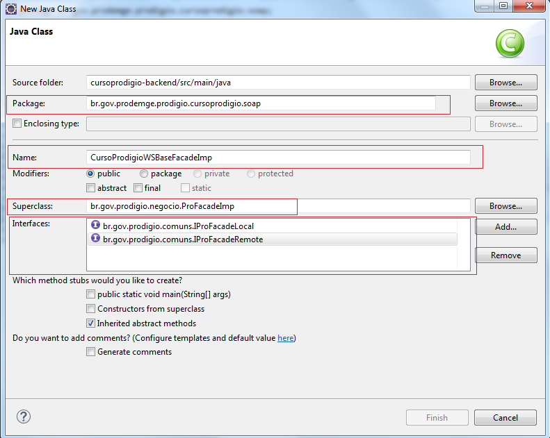

Anote a classe com as seguintes anotações e declare um atributo do tipo IProFacadeRemote com a anotação @EJB. 

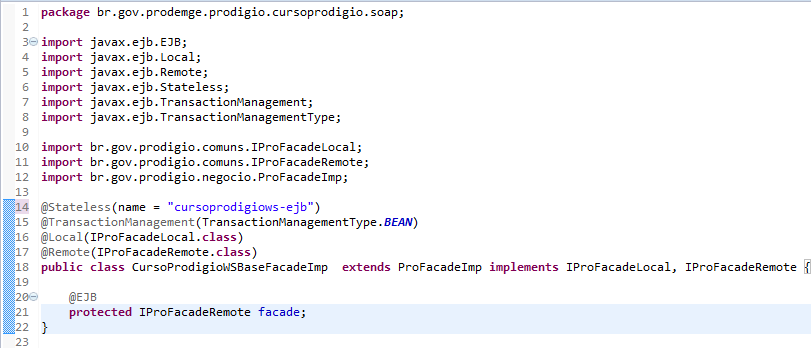

Crie a interface WS Facade de sua entidade com a assinatura dos métodos que serão usados como serviços.

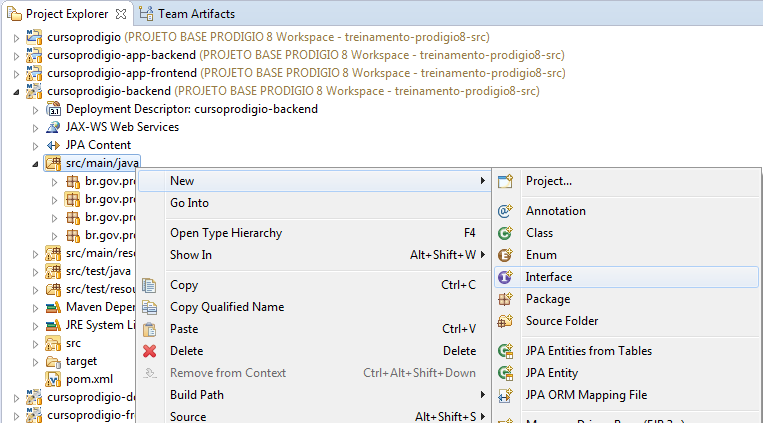

Obs.: o nome da interface deve seguir o padrão INomeDaEntidadeWSFacade.

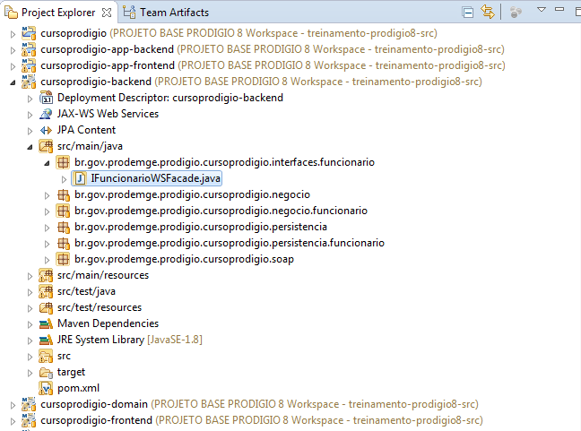

Conteúdo da interface:

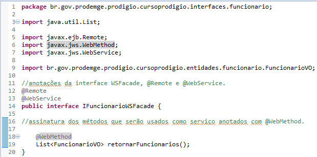

Crie a classe WSFacadeImp, esta classe deverá herdar de BaseWSFacadeImp  e implementar a interface criada no passo anterior.

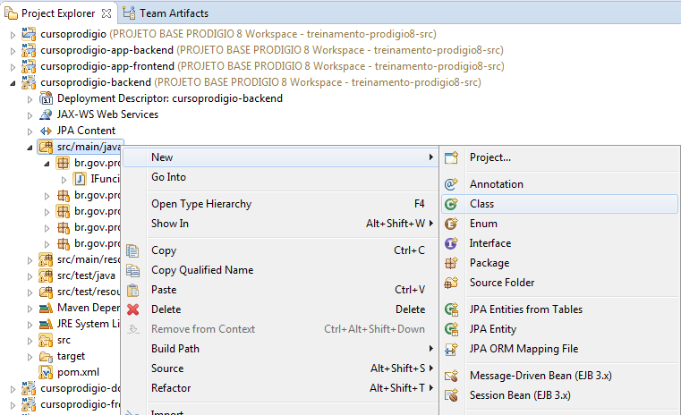

Obs.: o nome da classe deve seguir o padrão NomeDaEntidadeWSFacadeImp.
 
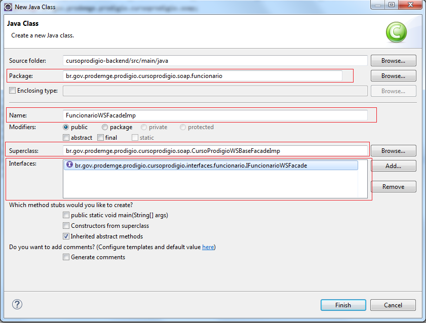

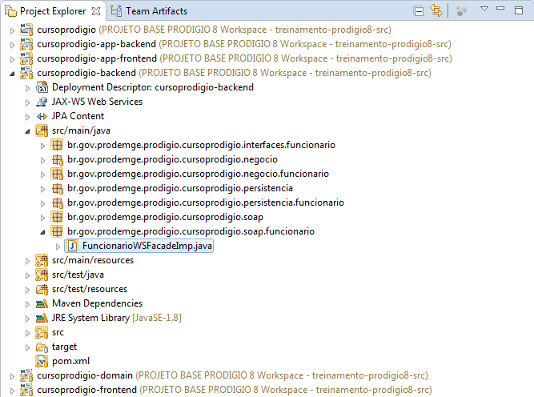

	//anotações da classe, @Stateless(name=”nomeEntidade-ejb”) e @WebService.
	@Stateless(name = "funcionario-ejb")
	@WebService
	public class FuncionarioWSFacadeImp extends CursoProddigioBaseWSFacadeImp implements IFuncionarioWSFacade {
		//implementação dos métodos
		@Override
		public List<FuncionarioVO> retornarFuncionarios() {
			FuncionarioVO funcionarioVO = new FuncionarioVO();
			Set<FuncionarioVO> funcionariosRetornados = new HashSet<FuncionarioVO>();
			try {
				funcionariosRetornados = facade.listarBaseadoNoExemplo(funcionarioVO, null, 0,Integer.MAX_VALUE, "nrVersao");
			} catch (Exception e) {
				// TODO Auto-generated catch block
				e.printStackTrace();
			}
			return new ArrayList<FuncionarioVO>(funcionariosRetornados);
		}
	}

### Testando  o serviço

Inicialize o servidor e acesse a URL para verificar se o serviço está disponivel: 

	http://localhost:8080/ nomeDaAplicacao-backend-1.0-SNAPSHOT/FuncionarioWSFacadeImp?wsdl

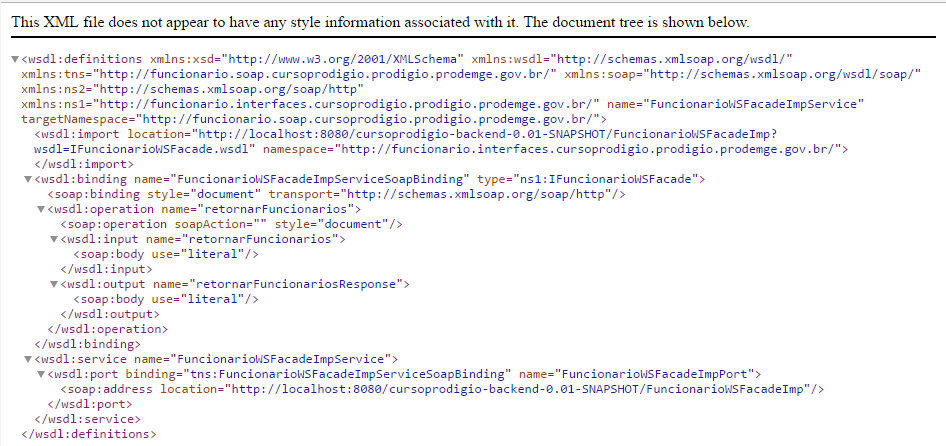

### SOAP UI

Baixe, instale e execute o SOAP UI (https://www.soapui.org/ ).

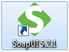

Crie um novo projeto SOAP

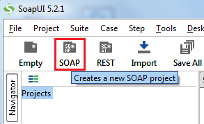
 
Nomeie seu projeto e no campo Initial WSDL coloque o caminho para o serviço criado(http://localhost:8080/nomeDoProjeto-backend-0.0.1-SNAPSHOT/FuncionarioWSFacadeImp?wsdl).

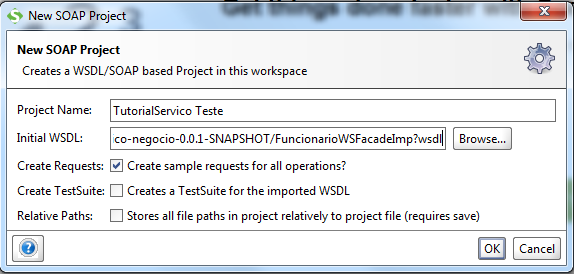
 
Abra a Request1

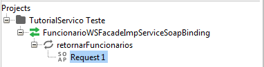
 
Execute a requisição.

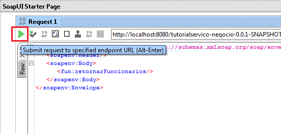
 
O resultado deverá ser parecido com:

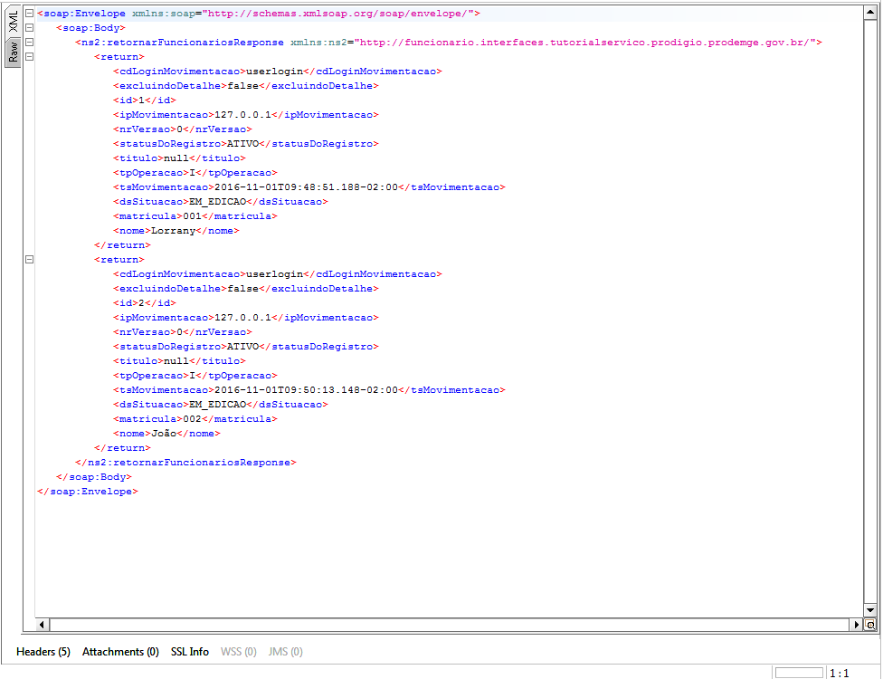

