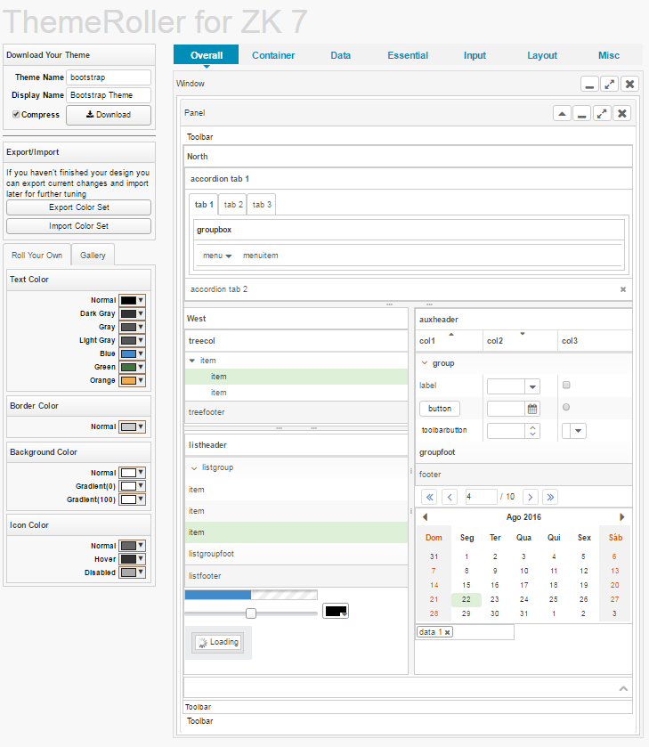

# Temas com ZkThemeRoller

### Introdução

Importante: Como o Zk Theme Roller 8 até o momento em que foi escrito este tutorial se encontrava em versão Beta, usaremos o Zk Theme Roller 7 e seguiremos alguns procedimentos para adaptar o tema para versão 8.

Acesse: https://www.zkoss.org/zkthemeroller/

### Visão geral da ferramenta:

* Download Your Theme -  campos para escolha de nome e  download do tema.
* Export/Import – opções de importar e exportar estilos do ThemeRoller.
* Roll Your Own – configurações de cores dos componentes.
* Gallery – galeria de templates prontos.
* Overall – componentes gerais.
* Container – componentes de caixas.
* Data – Grids, Listbox, Biglist, Tree.
* Essentials -  botões e menu e navbar.
* Input – componentes para entrada de dados.
* Layout – configuração de layout.
* Misk – Errorbox, Mask and Loading, Drag and Drop.

### Importando para versão 8

Após realizar as modificações desejadas, na aba ``Export/Import`` escolha a opção ``Export Color Set``. Será realizado o download de um arquivo .txt.

Acesse a versão 8 Beta do ZkThemeRoller em: https://www.zkoss.org/zkthemeroller80/

Agora importe o arquivo ``.txt`` do ``Color Set ``baixado. Todas as configurações feitas na versão 7 agora estão adaptadas para a versão 8.

Basta agora realizar o Download do tema em ``Download Your Theme``. 

### Habilitando o tema em projetos do Proddígio

1. Coloque o arquivo ``.jar`` de seu tema na pasta ``WEB-INF/lib`` de seu projeto Proddígio então seu tema personalizado se tornará padrão caso nenhum outro tema esteja habilitado.
2. Você pode fazer a troca de maneira dinâmica por cookie ou library property:
3. Usando cookie, adicione um cookie:
zktheme = NOME_DO_TEMA
4. Usando library-property

	<!--- em WEB-INF/zk.xml -->
	<library-property>
		<name>org.zkoss.theme.preferred</name>
		<value>NOME_DO_TEMA</value>
	</library-property>

