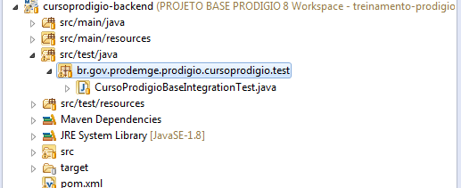
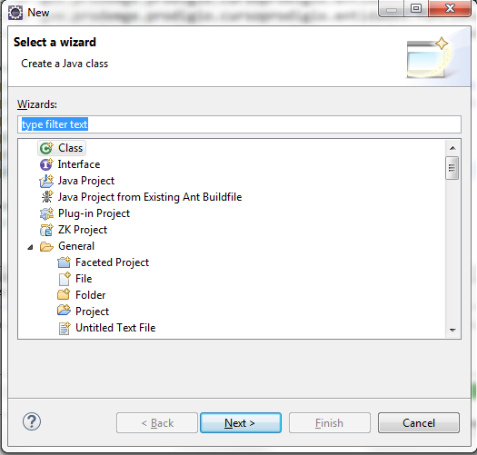
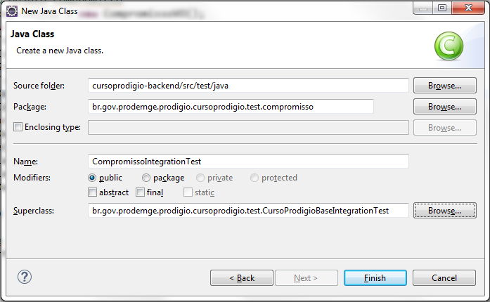
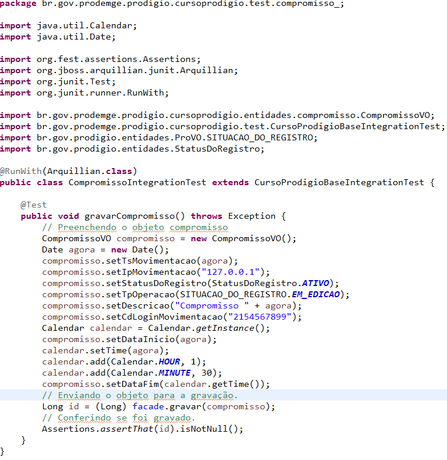
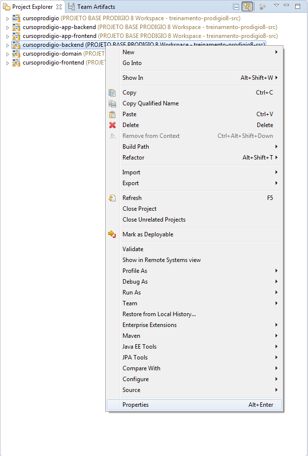
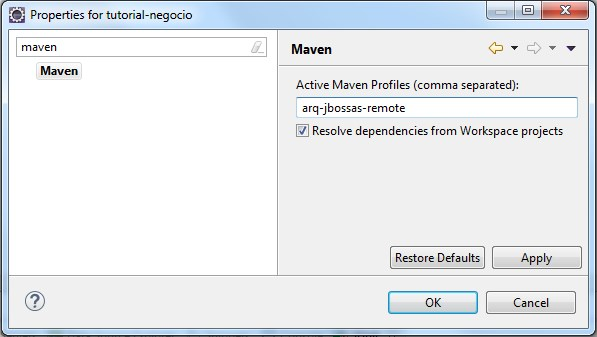

# Testando uma entidade no prod usando o Eclipse

Pressupondo que o projeto esteja devidamente criado e o servidor de aplicação esteja devidamente configurado, clique no pacote test do projeto cursoprod-backend na aba package explorer do Eclipse.  Veja a imagem abaixo:

Figura 1

Utilize as teclas de atalho CTR+N para abrir a janela de opções para criação de artefatos no Eclipse. Clique na opção Classe e depois em Next >.
 

Figura 2

Na janela seguinte, no campo Package: adicione o pacote compromisso após o pacote test e utilize o botão Browser para preencher o campo Superclass. Certifique-se que a tela esteja como a Figura 3 abaixo e então  clique em Finish.  Uma janela deve se abrir com um código de acordo com a Figura 4.

Figura 3

O próximo passo para iniciar o teste da entidade é configurar

Clique com o botão direito do mouse no projeto backend e em seguida clique na opção Properties. 
  

  
No campo superior esquerdo procure pela propriedade Maven e em seguida clique sobre ela. 

No campo ‘Active Maven Profiles’ localizado na parte direita da tela digite arq-jbossas-remote e aplique a modificação clicando no botão ‘Apply’, em seguida clique no  botão ‘Ok”. 
 

 
 