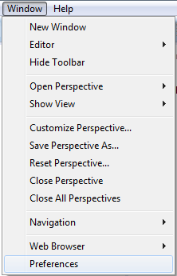

# Validação Arquitetural

### Introdução

Este documento visa explicar como realizar a validação arquitetural de um projeto Proddígio.

### Plugins

Primeiramente é necessário possuir os plugins ASML configurados em sua IDE, para isso basta realizar o download através do link ???????????????????? e adicionar os arquivos .jars na pasta plugins do Eclipse Luna.

Obs.: Ambientes criados com o instalador já possuem os plugins necessários.

### Dependências

Adicione as seguintes dependências no pom de seus respectivos projetos:

#### Comum

	<dependency> 
		<groupId>br.ufmg.asml</groupId>
		<artifactId>vaccine-comum</artifactId>
		<version> XXXX </version>
		<scope>provided</scope>
	</dependency> 

#### Domínio
		
	<dependency>
		<groupId>br.ufmg.asml</groupId>
		<artifactId>vaccine-dominio</artifactId>
		<version> XXXX </version>
		<scope>provided</scope>
	</dependency>	

 
####  Negócio-interface
		
	<dependency>
		<groupId>br.ufmg.asml</groupId>
		<artifactId>vaccine-negocio-interface</artifactId>
		<version> XXXX </version>
		<scope>provided</scope>
	</dependency>

#### Infraestrutura

	<dependency>
		<groupId>br.ufmg.asml</groupId>
		<artifactId>vaccine-infraestrutura</artifactId>
		<version>XXXX </version>
		<scope>provided</scope>
	</dependency>

#### Negócio

	<dependency>
		<groupId>br.ufmg.asml</groupId>
		<artifactId>vaccine-negocio</artifactId>
		<version> XXXX </version>
		<scope>provided</scope>
	</dependency>

#### Web

	<dependency>
		<groupId>br.ufmg.asml</groupId>
		<artifactId>vaccine-web</artifactId>
		<version> XXXX </version>
		<scope>provided</scope>
	</dependency>

### Habilitando ASML

Clique com o botão direito do mouse no projeto e em seguida selecione Configure>>Enable ASML builder

 
Realize este procedimento em todas os projetos para habilitar o ASML.
Obs.: É recomendado que habilite e aplique a vacina em um projeto por vez, do menos dependente para o mais dependente para que se resolva as quebras arquiteturais por partes com maior legibilidade.
 
### Aplicando Vacina

Acesse o menu Window>>Preferences

 
Vá para as configurações de Vaccine Preferences

Possuímos então as seguintes opções:

 
* **LIVE FEEDBACK VIOLATIONS** para validações em tempo real marque a opção, mas isso pode comprometer a performance, causar lentidão e provocar sobrecarga.
* **BUILD FEEDBACK VIOLATIONS** valida o projeto toda vez que o mesmo for compilado.
* **DEBUG** depura a validação.
* **SHOW STRUCTURAL VIOLATIONS** exibe as violações estruturais. 
* **SHOW RESTRICTION VIOLATION**  exibe as restrições violadas.

Aplique as modificações e clique em **VALIDATE** para validar seu projeto.

As violações arquiteturais sersão exibidas em Markers:

 
#### Arquivo Asml

O padrão arquitetural de cada projeto consta no arquivo ASML localizado no jar de cada vacina.
 

